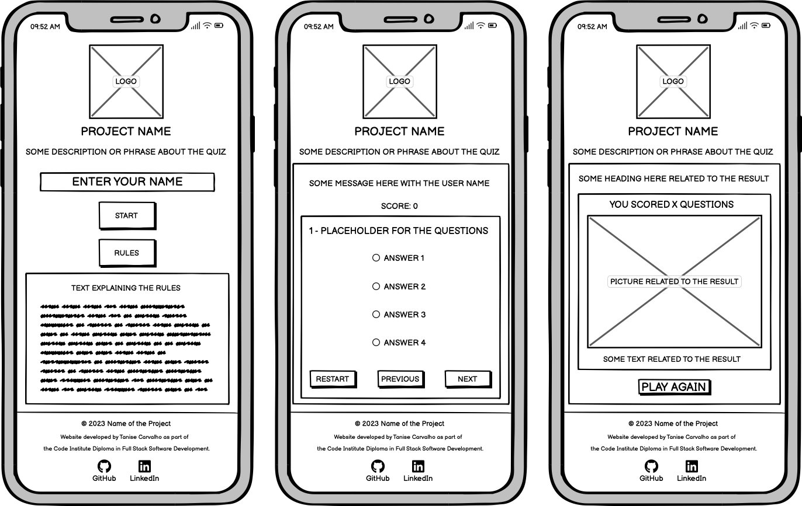

# Horns On Fire 🤘🔥

### Deployed Site: [Horns On Fire](https://tanisecarvalho.github.io/horns-on-fire/)

Horns On Fire is a quiz for those passionate about 80's and 90's Hard Rock who want to test their knowledge and have some fun.

Each match will show the user 10 questions with 4 possible answers each.

This quiz is divided into three categories: 

  * __Who am I?:__ In this category, the user will see the birth name of a musician and have to guess who they are.

  * __Power Ballads:__ In this category, the user will see part of the lyrics of a ballad and have to guess which song it is.

  * __Guess the Album:__ In this category, the user will see a blurred image of an album cover and have to guess which one is.

---

## CONTENTS

* [User Experience](#user-experience-ux)
  * [User Stories](#user-stories)

* [Design](#design)
  * [Colour Scheme](#colour-scheme)
  * [Typography](#typography)
  * [Imagery](#imagery)
  * [Wireframes](#wireframes)

* [Features](#features)
  * [General Features on Each Page](#general-features-on-each-page)
  * [Future Implementations](#future-implementations)

* [Technologies Used](#technologies-used)
  * [Languages Used](#languages-used)
  * [Frameworks, Libraries & Programs Used](#frameworks-libraries--programs-used)

* [Testing](#testing)

* [Deployment & Local Development](#deployment--local-development)
  * [Remote Deployment](#remote-deployment)
  * [Local Development](#local-deployment)
    * [How to Fork](#how-to-fork)
    * [How to Clone](#how-to-clone)
    * [Using Gitpod](#using-gitpod)

* [Credits](#credits)
  * [Code Used](#code-used)
  * [Content](#content)
  * [Media](#media)
  * [Acknowledgments](#acknowledgments)

---

## User Experience (UX)

### User Stories

* I want this website to be responsive to my device.

* I want to easily navigate on this website.

* I want to be able to play this quiz to test my 80's and 90's Hard Rock knowledge.

* I want to select different categories to play.

* I want to know if I selected the correct option.

* I want to know my score.

* I want to check my scores.

* I want to check the rules.

***

## Design

### Colour Scheme

The colour scheme was defined using the colours on the logo.

* `#F1473A` was used for H1, input text and main container background.

* `#EDEDED` was used as the primary colour for the website text and H2.

* `#171717` was used for background colour in case the image does not load, buttons text and border, and rules div background.

* `#F79326` was used for the buttons' background.

### Typography

I have used Google Fonts to select and import the font used on this website.

* For the quiz name, buttons and headings, the font used is [New Rocker](https://fonts.google.com/specimen/New+Rocker). As the name, the font is very similar to band logos. 

* For the body of the page, the font used is [Raleway](https://fonts.google.com/specimen/Raleway). As the font is sans-serif, it's easier to read and matches New Rocker.

### Imagery

The logo and background were created using [Canva](https://www.canva.com/). The horns were chosen as the logo as it is a characteristic symbol for rock n' roll fans. And from using it, the quiz's name came to life. The fire on the title is because it is common to comment about a concert that the band was on fire.

The results and 404-page images were used [Pexels](https://www.pexels.com/) to find images related to the topic.

For the __"Guess the Album"__ category, it was used the cover albums. All the images were taken from Amazon. All the credited links can be found [here](docs/albums.txt).

* Logo

* Background

### Wireframes

All the wireframes were created using [Balsamiq](https://balsamiq.com/).

  
Desktop

   

  * Start
  

   

  * Questions
  

   

  * Result
  

  
 Tablet 

   

  

  
 Mobile 

   

  

***

## Features

The site has one main page, __index.html__, where all the game is played. It also has a 404 page. Both pages are responsive.

* Favicon: Both pages have a favicon, which is the site logo.

* Header: During the whole game, the logo and name of the quiz with a short description are displayed at the top of the page.

* Footer: There is a footer at the end of the pages with the project name and links for the developer's LinkedIn and GitHub pages.

* Main Section: all the game happens here.

  * Home: What is shown when the user accesses the page or selects to start a new game. If the user doesn't enter a name and/or select a category, a message is shown, and the game only starts when the user attends to the requirements.
  
  

  * Rules: When the user clicks on the Rules button, the rules are loaded on the main section.
  

  * Leaderboard: When the user clicks on the Leaderboard button, the rules are loaded on the main section. The best 10 scores will be kept. The user has the option to clear the leaderboard.
  

  * Playing the Game: 10 random questions will be loaded according to the user's selected category.
  * Who am I?
  

  * Power Ballads
  

  * Guess the Album
  

  * When the user starts playing the game, a custom cursor 🤘 will display when it is over the options. After the user selects an option, the background will change to green for the correct one and red for the wrong ones. A black border will display around the option selected by the user. The score will display under the welcome message. If the user plays the "Guess the Album" category, the album will be blurred at the start, and the original picture will show after selecting an option.
  

  * The user can go back and forth between questions.
  

  * The game is only finished once the user answers all the questions.
  

  * Result: The result is loaded to the user when the game is finished. It shows the score, a message and an image based on how many points the user got.
  
  
  

  * 404 Page: An error 404 page was designed to facilitate the user's return to the home page if they try to access an inexistent page.
  

### Future Implementations

For future implementations, I would like to:

* Connect the application to a database so that I can increase the number of questions on the questions bank.
* Have different levels for the user to play.
* Have the matches saved into the database so the leaderboard would show all users that play the game, not only the ones by the browser.

## Technologies Used

### Languages Used

HTML, CSS & JavaScript.

### Frameworks, Libraries & Programs Used

This project used:

* [Balsamiq](https://balsamiq.com/) to create the wireframes.

* [Git](https://git-scm.com/) for version control.

* [GitHub](https://github.com/) to store the project files.

* [GitPod](https://gitpod.io/) as the IDE for development.

* [GitHub Pages](https://pages.github.com/) to deploy the website.

* [Favicon](https://favicon.io/) to transform the logo into a favicon.

* [Canva](https://www.canva.com/) to create the logo and background image.

* [Google Fonts](https://fonts.google.com/) to import the fonts used on the website.

* [Font Awesome](https://fontawesome.com/) for icons.

* [Coolors](https://coolors.co/) to create the colour scheme based on the logo.

* [Pexels](https://www.pexels.com/) for the results and 404 error page images. 

* [Emoji Cursor](https://www.emojicursor.app/) to create the 🤘 cursor on the game.

* [Gyazo GIF](https://gyazo.com/) to create gifs of this project features for this documentation.

## Testing

Please check the [TESTING.md](TESTING.md) file for all the tests.

## Deployment & Local Development

### Remote Deployment

The site was deployed to GitHub pages. The steps to deploy are as follows: 
  1. In the GitHub repository, navigate to the Settings tab 
  2. On the left side menu, click on Pages in the section Code and automation.
  3. From the source section drop-down menu, select Deploy from a branch.
  4. From the branch section drop-down menu, select main, and right on the side, select /root.
  5. GitHub will create the page once the branch menus have been selected. It might take a few minutes. A link will appear at the top of the page when it is done.

The live link can be found here - [Hors on Fire](https://tanisecarvalho.github.io/horns-on-fire/)

### Local Development

#### How to Fork

  1. Log In or Sign Up to GitHub.
  2. Go to this project repository [https://github.com/tanisecarvalho/horns-on-fire](https://github.com/tanisecarvalho/horns-on-fire)
  2. On the top right of the page, there's a button with the option Fork. Click on it.
  3. A new page, "Create a new fork", will open. If you wish, you can edit the name.
  4. At the end of the page, click on "Create fork".
  5. Now, you have a copy of the project in your repositories.

#### How to Clone

  1. Log In or Sign Up to GitHub.
  2. Go to this project repository [https://github.com/tanisecarvalho/horns-on-fire](https://github.com/tanisecarvalho/horns-on-fire)
  3. Click on the Code button and select if you would like to clone with HTTPS, SSH or GitHub CLI and copy the link.
  4. Open the terminal in the code editor of your choice and change the current working directory to the one you will use for to clone the repository.
  5. Type 'git clone' into the terminal and then paste the link you copied before and press Enter.

#### Using Gitpod
This site was developed using Gitpod. To edit your copy on Gitpod, you will need to: 
  1. On your browser of choice, install the Gitpod extension/add-on.
  2. On GitHub, open the project repository you forked before.
  3. On the top of the page, over the files, there is a green button on the right side of the page saying "Gitpod". Click it.
  4. It will open the Gitpod website. On the first time, you will select to connect with your GitHub account and Authorize gitpod-io. After that, you'll create an account.
  5. It might take a while after that because Gitpod will create your workspace.
  After the workspace is loaded, you can edit it on Gitpod.

## Credits

### Code Used

* [This code](https://cssdeck.com/blog/create-a-burning-text-effect-with-css3/) from CSS Deck was used and adapted to create the burning effect on the quiz name.

* [This code](https://www.w3schools.com/howto/howto_css_image_effects.asp) from W3Schools was used to understand how to use the blur filter on the album cover category.

* [This article](https://dev.to/codebubb/how-to-shuffle-an-array-in-javascript-2ikj) from DEV was used to understand shuffle arrays and adapt to shuffle answers on the game.

* [Emoji Cursor](https://www.emojicursor.app/) was used to change the cursor to 🤘 when it's over the answer options.

* I used [Kera Cudmore](https://github.com/kera-cudmore/readme-examples) README tutorial to improve my README.md file.

### Content

I already knew all the names, bands, lyrics and albums from the site. But to avoid spelling mistakes, I have used Google Search to confirm them. The sources brought by the information on Google were:

  * Lyrics: [Musixmatch](https://www.musixmatch.com)
  * Names: [Wikipedia](https://www.wikipedia.org)

### Media

All the links of the album covers can be found on [this document](docs/albums.txt).

The following images were taken from [Pexels](https://www.pexels.com/).

* Results
  * [Result 1](https://www.pexels.com/photo/tilt-shift-lens-photography-of-stone-161702/)
  * [Result 2](https://www.pexels.com/photo/silhouette-people-photographing-at-music-concert-325811/)
  * [Result 3](https://www.pexels.com/photo/person-playing-guitar-on-stage-with-light-ray-167629/)
* [404 Page](https://www.pexels.com/photo/an-empty-theatre-with-lights-turned-on-during-nighttime-10880677/)
 
### Acknowledgments

I would like to thank my Code Institute mentor, Chris Quinn for his support and insightful feedbacks. Plus, to my friends and family for being the first users of this quiz since the first time I started developing it. And to all the 80's and 90's Hard Rock bands for being the constant soundtrack of my life.