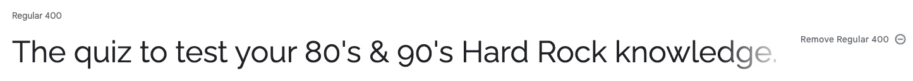

# Horns On Fire 🤘🔥

Horns On Fire is a quiz for those passionate about Rock n' Roll to test their knowledge on this genre.

This quiz includes questions about musicians, albums, music, and the genre in general.

Include amiresponsive image

Live Link: [Horns On Fire](https://tanisecarvalho.github.io/horns-on-fire/)

---

## CONTENTS

* [User Experience](#user-experience-ux)
  * [User Stories](#user-stories)

* [Design](#design)
  * [Colour Scheme](#colour-scheme)
  * [Typography](#typography)
  * [Imagery](#imagery)
  * [Wireframes](#wireframes)

* [Features](#features)
  * [General Features on Each Page](#general-features-on-each-page)
  * [Future Implementations](#future-implementations)
  * [Accessibility](#accessibility)

* [Technologies Used](#technologies-used)
  * [Languages Used](#languages-used)
  * [Frameworks, Libraries & Programs Used](#frameworks-libraries--programs-used)

* [Deployment & Local Development](#deployment--local-development)
  * [Remote Deployment](#remote-deployment)
  * [Forking](#forking)
  * [Local Deployment](#local-deployment)

* [Testing](#testing)

* [Credits](#credits)
  * [Code Used](#code-used)
  * [Content](#content)
  * [Media](#media)
  * [Acknowledgments](#acknowledgments)

---

## User Experience (UX)

### User Stories

* I want to be able to play this quiz to test my Rock n' Roll knowledge.
* I want this website to be responsive to my device.
* I want to easily navigate on this website.
* I want to know my score.
* I want to play with or without sound.
* I want to know how long I take to answer the quiz.
* I want to know if I selected the correct option.

***

## Design

### Colour Scheme

The colour scheme was defined using the colours on the logo.

* `#F1473A` was used for H1, input text and main container background.
* `#EDEDED` was used as primary colour for the website text and H2.
* `#171717` was used for background colour in case the image does not load, buttons text and border, and rules div background.
* `#F79326` was used for buttons background.

### Typography

I have used Google Fonts to select and import the font used on this website.

* For the quiz name, buttons and headings the font used is [New Rocker](https://fonts.google.com/specimen/New+Rocker). As the name, the font is very similar to band logos. 

* For the body of the page the font used is [Raleway](https://fonts.google.com/specimen/Raleway) as the font is very clear to understand and matches with New Rocker.

### Imagery

The logo and background were created using [Canva](https://www.canva.com/). The horns was chosen to be the logo as it is a caracteristic symbol for rock n' roll fans. And from using the symbol is that the name of the quiz came to life. The fire on the name is because it is common to say of a concert that the band was on fire.

* Logo

* Background

### Wireframes

All the wireframes were created using [Balsamiq](https://balsamiq.com/).

  
Desktop

   

  * Start
  

   

  * Questions
  

   

  * Result
  

  
 Tablet 

   

  Create wireframes for tablet

  
 Mobile 

   

  

***

## Features

Show here all the features.

### Future Implementations

Future things I would love to implement.

### Accessibility

Check more about accessibility and don't forget to include aria-labels.

## Technologies Used

### Languages Used

HTML, CSS & JavaScript.

### Frameworks, Libraries & Programs Used

add the links and for what I used them

* Git
* GitHub
* GitPod
* GitHub Pages
* Favicon
* Canva
* Balsamiq
* Google Fonts
* Font Awesome
* Coolors

## Deployment & Local Development

### Remote Deployment

The site was deployed to GitHub pages. The steps to deploy are as follows: 
  * In the GitHub repository, navigate to the Settings tab 
  * On the left side menu, on the section Code and automation, click on Pages.
  * From the source section drop-down menu, select the Deploy from a branch.
  * From the branch section drop-down menu, select main, right on the side select /root.
  * Once the the branch menus have been selected, github will create the page. It might take a few minutes. Once it is done a link will show up on the top of the page.

The live link can be found here - 

### Forking
To fork this site go to its GitHub repository [insert link here]
  * On the top right of the page there's a button with the option Fork, click on it.
  * A new page "Create a new fork" will open. If you wish, you can edit the name.
  * In the end of the page click on the button "Create fork".
  * Now you have a copy of the project on your repositories.

### Local Deployment
This site was developed using Gitpod. To edit your copy on Gitpod you will need to: 
  * On your browser of choice install the gitpod extension/add-on.
  * On GitHub open the project repository you forked before.
  * On the top of the page, over the files, there is a green button on the right side of the page saying "Gitpod". Click it.
  * It will open the Gitpod website. On the first time, you will select to connect with your GitHub account and Authorize gitpod-io. After that you'll be creating an account.
      * It might take a while after that because gitpod will be creating your workspace.
  * After the workspace is loaded, you're able to edit it on Gitpod.

## Testing

Please check the [TESTING.md](TESTING.md) file for all the tests.

## Credits

### Code Used

* [This code](https://cssdeck.com/blog/create-a-burning-text-effect-with-css3/) was used and adapted to create the burning effect on the quiz name.

* [Emoji Cursor](https://www.emojicursor.app/) was used to change the cursor to 🤘 when mouse hovering the answer options.

* I used [Kera Cudmore](https://github.com/kera-cudmore/readme-examples) tutorial to improve my README.md file.

### Content

Put here from where I will get the questions and answers.

###  Media

In case I use other images for 404 page and results.
  
###  Acknowledgments

Include people to thank