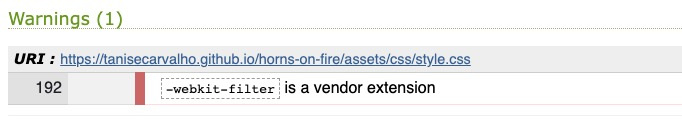
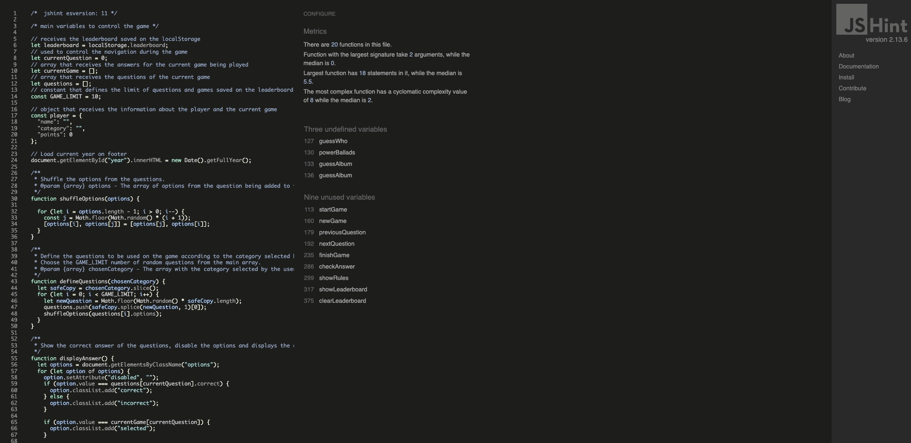
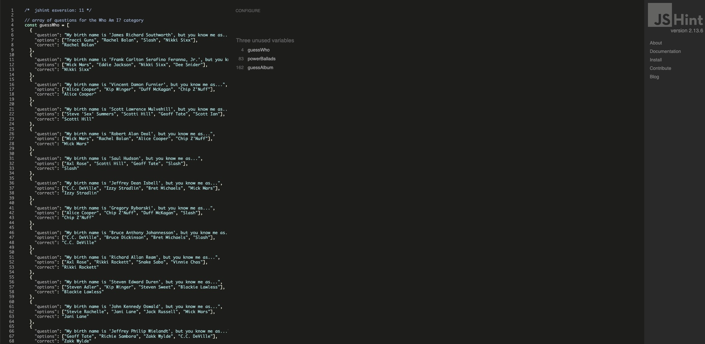
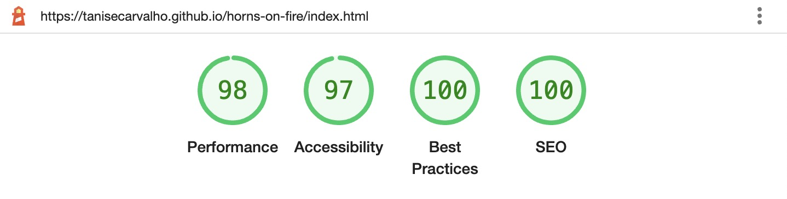
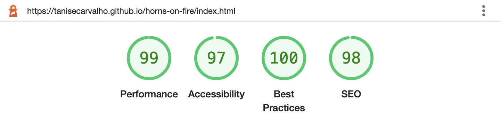
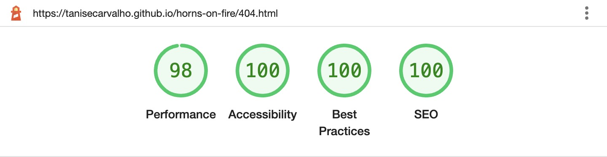
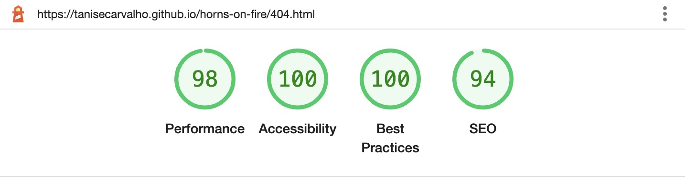

# Horns On Fire 🤘🔥 - TESTING

### Deployed Site: [Horns On Fire](https://tanisecarvalho.github.io/horns-on-fire/)

---

## CONTENTS

* [AUTOMATED TESTING](#automated-testing)
  * [W3C Validator](#w3c-validator)
  * [Jigsaw Validator](#jigsaw-validator)
  * [JavaScript Validator](#javascript-validator)
  * [Lighthouse](#lighthouse)

* [MANUAL TESTING](#manual-testing)
  * [Testing User Stories](#testing-user-stories)
  * [Full Testing](#full-testing)

* [BUGS](#bugs)
  * [Known Bugs](#known-bugs)

Testing was realised during the whole development of this project. Chrome Devtools was the primary tool utilised in this process. 

Additionally, since the quiz became functional, the site was deployed. The link was shared with friends and family to get their constant feedback towards the functionalities, design and accessibility.

---

## AUTOMATED TESTING

###  W3C Validator

No errors were returned when passing the pages through the official W3C validator:

* [Main Page](https://validator.w3.org/nu/?doc=https%3A%2F%2Ftanisecarvalho.github.io%2Fhorns-on-fire%2Findex.html)

* [404 Page](https://validator.w3.org/nu/?doc=https%3A%2F%2Ftanisecarvalho.github.io%2Fhorns-on-fire%2F404.html)

### Jigsaw Validator

No errors were found when passing through the official (Jigsaw) validator:

* [style.css](https://jigsaw.w3.org/css-validator/validator?uri=https%3A%2F%2Ftanisecarvalho.github.io%2Fhorns-on-fire&profile=css3svg&usermedium=all&warning=1&vextwarning=&lang=en)

One warning was founding during this validation, but it doesn't affect the functionality of this site.

### JavaScript Validator

No errors were found when passing through [jshint](https://jshint.com/):

* script.js
  * The __Three undefined variables__ are the questions defined on questions.js declared before script.js.
  * The __Nine unused variables__ are the functions called by the events on HTML elements.

  

* questions.js
  * The __Three unused variables__ are the questions called on script.js.

  

### Lighthouse

I used Chrome Developer Tools' Lighthouse to test the Performance, Accessibility, Best practices and SEO of the website.

* Main Page
  * Desktop
    
  * Mobile
    
* 404 Page
  * Desktop
    
  * Mobile
    

---

## MANUAL TESTING

### Testing User Stories

| Goals | How are they achieved? |
| :--- | :--- | 
| I want this website to be responsive to my device. | The site was developed with responsiveness in mind and a mobile-first approach. | 
| I want to easily navigate on this website. | The site works with only one page. All the content loaded within the main section have buttons with actions that will lead the user to the expected function. The logo also works as a link to the first state of the page. | 
| I want to be able to play this quiz to test my 80's and 90's Hard Rock knowledge. | All the questions on the quiz were created focusing on the Hard Rock from the 80's and 90's. | 
| I want to select different categories to play. | I created three different cateogries for the user to select. | 
| I want to know if I selected the correct option. | When the user select their answer, the colour on the options' buttons change: green if it's correct and red if it's incorrect. | 
| I want to know my score. | The score is displayed and updated during the whole game above the question. The score is also displayed when the game finish. | 
| I want to check my scores. | A leaderboard was created and it saves the last 10 best scores played on the browser. I used localStorage to save the scores. | 
| I want to check the rules. | A button was created that loads the rules for the user. It's accessible before the user start a new game. | 

### Full Testing

This site was tested in the following devices:

* Laptop
  * 13-inch MacBook Air 2020 (+ LG 22-inch Monitor)
    * Browsers: Google Chrome, Firefox and Safari.
* Mobile
  * iPhone SE 2020
    * Browsers: Google Chrome and Safari
  * Xiaomi 11 Lite 5G NE
    * Browser: Google Chrome

Also, the site was tested by family and friends on a variety of devices/screen sizes/browsers. No issues were reported.

`Main Page`

| Feature | Expected Outcome | Testing Performed | Result | Pass/Fail |
| --- | --- | --- | --- | --- |
| Site Logo | Redirect to Home Page | Click logo | Redirects to Home Page | Pass |
| Start Button | Don't start the game without name and/or category | Click Start button without entering name and selecting category | Show message informing the user to enter name and select category | Pass |
| Start Button | Start the game after entering name and selecting category | Click Start button with name and category informed | Loads the first question of the game | Pass |
| Rules Button | Show Rules | Click Rules button | Shows the rules of the game loaded on the main section | Pass |
| Leaderboard Button | Show Leaderboard | Click Leaderboard button | Shows the leaderboard loaded on the main section | Pass |

`Rules`

| Feature | Expected Outcome | Testing Performed | Result | Pass/Fail |
| --- | --- | --- | --- | --- |
| Close button | Close rules and show Main Page | Click Close button | Closes rules and shows Main Page | Pass |
|  |  |  |  |  |

`Leaderboard`

| Feature | Expected Outcome | Testing Performed | Result | Pass/Fail |
| --- | --- | --- | --- | --- |
| Close button | Close leaderboard and show Main Page | Click Close button | Closes leaderboard and shows Main Page | Pass |
| Clear button | Clear leaderboard | Click Clear button | Cleans the leaderboard | Pass |

`Started Game`

| Feature | Expected Outcome | Testing Performed | Result | Pass/Fail |
| --- | --- | --- | --- | --- |
| Display user's name | Display user's name on the top of the game area | Started the game | User's name displays on the top of the game area | Pass |
| Display score | Display score bellow the user's name | Answer first question | Starts displaying score bellow user's name | Pass |
| 🤘 Cursor | The 🤘 should display when the user moves the mouse over one of the possible answers' buttons | Move the mouse over the possible answers' buttons | The cursor changed from the default to the 🤘 cursor | Pass |
| Load Question | The question is loaded chosen at random from the questions bank according to the category selected | Checked on Devtools if the array of questions was correctly populated with questions from the correct category | The question of the selected category is being displayed on the screen | Pass |
| Load Answers | The answers are being loaded shuffled each time a new game starts | Checked on Devtools if the array of questions brought also the answers | The answers for the current question are being displayed on screen | Pass |
| Correct Answer - change background | Change the background colour of the correct answer to green | Selected an answer | When selecting an answer, the correct one had its background colour changed to green | Pass |
| Incorrect Answer - change background | Change the background colour of the incorrect answers to red | Selected an answer | When selecting an answer, the incorrects ones had their background colour changed to red | Pass |
| Selected Answer - change border | Change the border colour of the selected answer to black | Selected an answer | When selecting an answer its border colour changed from white to black | Pass |
| Next button | Load the next question | Click Next button | The next question was displayed | Pass |
| Next button change to Finish button | Change the Next button to Finish button when the user is on the last question | Click Next button until reaches the last question | Next button is no longer displayed and is replaced by Finish button | Pass |
| Previous button | Load the previous question | Click Previous button | The previous question was displayed, except when the user is on the first question, then the button is disabled | Pass |
| New Game button | Load the Main Page where the user has the option to start a new game, see rules and leaderboard | Click New Game button | Loads the Main Page where the user has the option to start a new game, see rules and leaderboard | Pass |
| Finish button - all questions answered | Finish the game and load result | Click Finish button | Finishes the game and display result with score and personalised image and message | Pass |
| Finish button - without answering all questions | Don't finish the game and displays message bellow the answers informing the user to answer all questions | Click Finish button | The game is not finished and a message is displayed bellow the answers informing the user to answer all before finish | Pass |
| Display answered questions | When navigating through questions, display the already answered questions with the current selection and which are correct/incorrect | Click Next and/or Previous button | The already answered questions are displayed with user's selection and showing which ones are correct/incorrect | Pass |
| `Guess the Album` category - blurred album cover to displaying album without the effect | When the user is playing the 'Guess the Album' category, after selecting an answer, the album that is blurred loses the effect and is displayed correctly | Click answer button | After selecting the answer the album cover loses the effect and is displayed correctly | Pass |

`Finished Game - Result` 
| Feature | Expected Outcome | Testing Performed | Result | Pass/Fail |
| --- | --- | --- | --- | --- |
| Display score | Display the number of questions the user scored | Finish the game | Displays the number of questions the user scored | Pass |
| Result Message | Display result message according to the score reached | Played the game with a variety of scores | Displays result message according to the score reached | Pass |
| Result Image | Display result image according to the score reached | Played the game with a variety of scores | Displays result image according to the score reached | Pass |
| Home button | Load the Main Page where the user has the option to start a new game, see rules and leaderboard | Click New Game button | Loads the Main Page where the user has the option to start a new game, see rules and leaderboard | Pass |

`Footer`
| Feature | Expected Outcome | Testing Performed | Result | Pass/Fail |
| --- | --- | --- | --- | --- |
| Developer GitHub Link | Take the user to the developer's GitHub page | Click GitHub icon | Opens a new tab with the developer's GitHub page | Pass |
| Developer LinkedIn Link | Take the user to the developer's LinkedIn page | Click LinkedIn icon | Opens a new tab with the developer's LinkedIn page | Pass |

`404 Page`

| Feature | Expected Outcome | Testing Performed | Result | Pass/Fail |
| --- | --- | --- | --- | --- |
| Site Logo | Redirect to Home Page | Click logo | Redirects to Home Page | Pass |
| Link to Home Page | Redirects to Home Page | Click link | Redirects to Home Page | Pass |
| Link to Home Page - hover effect | The link should change color from #F79326 to #171717 when hovered over | Hover over the link | Link changes color when hovered over | Pass |

---

## BUGS

### Known Bugs

When accessing the site on the iPhone SE 2020, on the Main Page, the text "Choose a category" is not centralised. I couldn't reproduce it on Devtools, and in other mobile devices it's working correctly.

---

Back to [README.md](README.md)